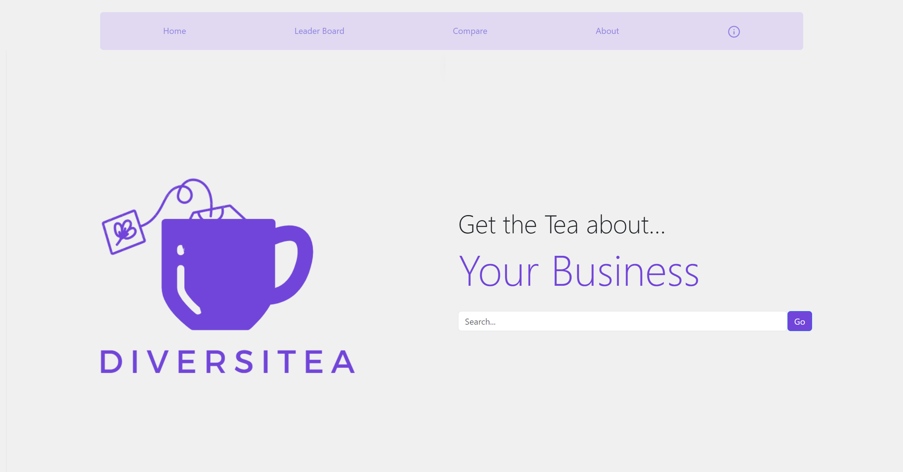

# Diversitea

Group Members: 

Alexander Georgiev (alexandersg@vt.edu)

Evan Lee (evan0110@vt.edu) 

Rowan Cusano (rowanc@vt.edu)

Amado Otoro (amadoo@vt.edu) 

Dev Post: https://devpost.com/software/diversitea-y4o5pa

## Project Details

### Inspiration

Diversitea was born out of a shared passion for promoting diversity and inclusion in the corporate world. Our team recognized the need for a platform that goes beyond conventional company insights, focusing specifically on the experiences of women and individuals from diverse racial backgrounds.

### What it does
Diversitea serves as a tool for making more informed decisions about companies. We provide a deep dive into essential details, shining a spotlight on diversity and inclusion aspects. When you're exploring companies, our platform lets you gather comprehensive information, enabling side-by-side comparisons. Finally Leaderboards point you towards the best companies for your needs, ensuring you find the best fit for your needs while prioritizing diversity and inclusion in your decision-making journey.
